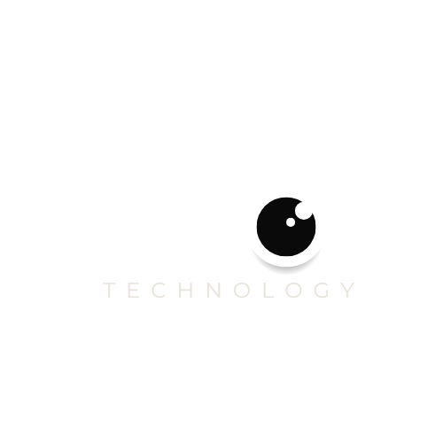
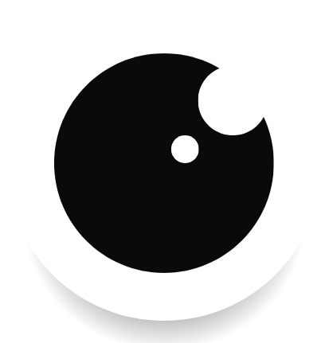

# Vision Technology
## 📌 Descrição do Projeto
A Vision Technology é uma plataforma web desenvolvida para apoiar organizações de saúde, ONGs, institutos e projetos sociais na gestão de pacientes, triagens, atendimentos, equipes e indicadores operacionais.
O projeto nasceu no contexto do Challenge da FIAP, a partir de uma oportunidade real identificada em parceria com a Turma do Bem. A proposta da Vision é centralizar informações que normalmente ficam espalhadas em planilhas, mensagens, formulários e controles manuais, transformando a operação de cuidado em um fluxo mais organizado, rastreável e eficiente.
A solução conta com duas frentes principais:
Site institucional, com apresentação da solução, proposta de valor, páginas informativas e contato;
Plataforma interna, com áreas para administradores e dentistas, incluindo cadastro de pacientes, fila externa, dashboards, agenda, gestão de equipe e acompanhamento de atendimentos.
---
## 👥 Autores e Créditos
Projeto desenvolvido por estudantes da FIAP:
Karen Cardoso — RM: 566870
Henrique Bagueixe — RM: 568292
Denise Santos — RM: 567559
Instituição: FIAP — Faculdade de Informática e Administração Paulista
Projeto desenvolvido no contexto: Challenge FIAP + Turma do Bem
---
## 🚀 Tecnologias Utilizadas
O projeto foi desenvolvido utilizando as seguintes tecnologias:
React
Vite
TypeScript
Tailwind CSS
React Router DOM
React Hook Form
Lucide React
Framer Motion
tw-animate-css
Java
API REST
Oracle Database
Git e GitHub
Vercel
---
## 📦 Principais Dependências NPM
As principais dependências utilizadas no front-end são:
`react`
`react-dom`
`react-router-dom`
`react-hook-form`
`lucide-react`
`framer-motion`
`tw-animate-css`
`tailwindcss`
`@tailwindcss/vite`
`vite`
`typescript`
Para instalar todas as dependências do projeto, basta executar:
```bash
npm install
```
---
## 🧩 Funcionalidades Principais
Site institucional
Página inicial com apresentação da Vision;
Página sobre o projeto, FIAP e Turma do Bem;
Página de solução com módulos da plataforma;
Página de FAQ;
Página de contato;
Página do time;
Página 404 personalizada para o site.
Plataforma interna
Login da plataforma;
Home da plataforma;
Cadastro externo para avaliação;
Fila de pacientes externos;
Aprovação ou recusa de pacientes externos;
Painel administrativo;
Cadastro de novo paciente;
Dashboard com indicadores;
Agenda;
Gestão de equipe;
Cadastro de dentistas e funcionários;
Área do dentista;
Fila de atendimento;
Registro de atendimentos;
Histórico de atendimentos;
Página 404 personalizada para a plataforma.
---
## 📁 Estrutura de Pastas
A estrutura do projeto foi organizada separando os arquivos por domínio, facilitando a manutenção e evolução da aplicação.
```txt
src/
├── assets/
│
├── components/
│   ├── platform/
│   │   ├── NavPlataformaHome/
│   │   ├── NavPlataformaInterna/
│   │   └── outros componentes da plataforma
│   │
│   └── site/
│      ├── Navbar/
│      ├── Footer/
│      ├── FeatureCard/
│      ├── PlatformModuleCard/
│      ├── PlatformModulesSection/
│      └── outros componentes do site
│   
│
├── data/
│   ├── platform/
│   │   └── navLinks.ts
│   │   └── pacientes.ts
│   │
│   └── site/
│       ├── faq.ts
│       ├── homeFeatures.ts
│       ├── solutionModules.ts
│       └── team.ts
│       └── outros .ts do site
│
├── layouts/
│   └── LayoutSite/
│
├── pages/
│   ├── platform/
│   │   ├── Admin/
│   │   ├── AdminAgenda/
│   │   ├── AdminDashboards/
│   │   ├── CadastroEnviado/
│   │   ├── CadastrarDentista/
│   │   ├── CadastrarFuncionario/
│   │   ├── ConviteEnviado/
│   │   ├── DefinirSenha/
│   │   ├── Dentista/
│   │   ├── DentistaAgenda/
│   │   ├── DentistaAtendimentos/
│   │   ├── DentistaHistorico/
│   │   ├── Equipe/
│   │   ├── FilaExterna/
│   │   ├── FormCadastro/
│   │   ├── LoginPlataforma/
│   │   ├── NotFound/
│   │   ├── NovoPaciente/
│   │   └── PlataformaHome/
│   │
│   └── site/
│       ├── Contato/
│       ├── Faq/
│       ├── Home/
│       ├── NotFoundSite/
│       ├── Sobre/
│       ├── Solucao/
│       └── Time/
│
├── styles/
│   └── index.css
│
├── App.tsx
└── main.tsx
```
---
## 🖼️ Imagens e Ícones Relacionados ao Projeto
O projeto utiliza imagens, logotipos, prints da plataforma e ícones para reforçar a identidade visual da Vision.
Identidade visual
Logo Vision Technology;


Favicon personalizado;

Paleta visual com laranja, preto, branco e tons neutros;
Tipografia moderna;
Elementos visuais inspirados em plataformas SaaS e healthtechs.
Ícones
Os ícones utilizados no projeto são da biblioteca Lucide React, incluindo ícones para:
Pacientes;
Agenda;
Dashboards;
Equipe;
Formulários;
Login;
Atendimento;
Histórico;
Contato;
Navegação.
Imagens e prints
As imagens e prints utilizados no projeto ficam armazenados principalmente nas pastas:
```txt
public/img/
```
Esses arquivos são utilizados para representar:
Interface da plataforma;
Módulos da solução;
Integrantes do time;
Logo e identidade visual;
Imagens institucionais.
---
## 💻 Como Usar o Projeto
1. Clone o repositório
```bash
git clone COLOQUE_AQUI_O_LINK_DO_REPOSITORIO
```
2. Acesse a pasta do projeto
```bash
cd vision-tech
```
3. Instale as dependências
```bash
npm install
```
4. Execute o projeto localmente
```bash
npm run dev
```
5. Acesse no navegador
```txt
http://localhost:5173
```
---
## 🔗 Links do Projeto
Repositório GitHub
```txt
https://github.com/karenlldl/VisionTech
```
Vídeo de apresentação
```txt
Em breve
```
O vídeo ainda será publicado no YouTube.
Projeto hospedado na Vercel
```txt
https://vision-tech-platform.vercel.app/
```
## Usuários para login na plataforma:<br/>
Admin<br/>
E-mail: dentista@vision.com<br/>
Senha: 123456<br/>
<br/>
Dentista<br/>
E-mail: vision@vision.com<br/>
Senha: 123456<br/>
---
## 📬 Contato
Para dúvidas, sugestões ou informações sobre o projeto:
```txt
visiontechlogy.org@gmail.com
```
Também é possível acessar a página de contato diretamente no site da Vision.
---
## 📄 Licença
Este projeto foi desenvolvido para fins acadêmicos como parte do Challenge FIAP.